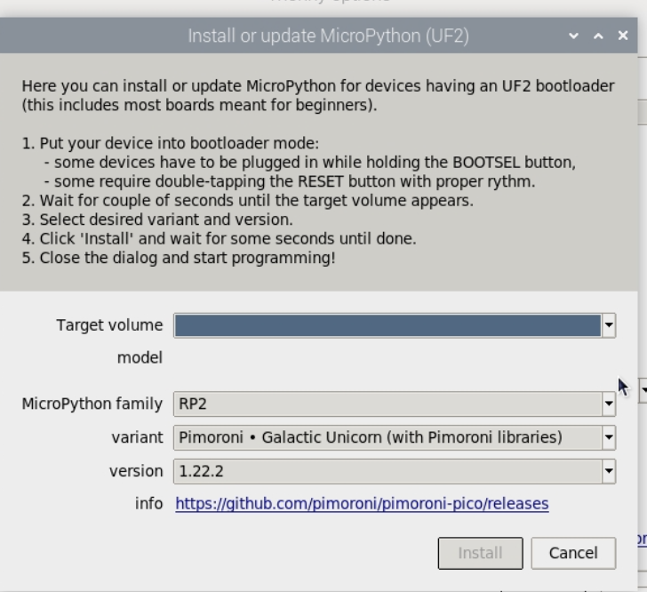
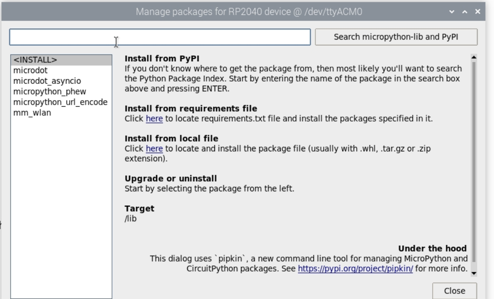

# Glitch Ticker

**Glitch ticker** is a loud quirky text scroller accessible over http implemented using the **microdot** framework

## Hardware
Implemented using the  [Galacitc Unicorn](https://shop.pimoroni.com/products/space-unicorns?variant=40842033561683) board to create text ticker in micropython. Follow the 

## Installation
- The **Galactic Unicorn micropython** is installed using **thonny**. 
> N.B Recommend going through the installation process on the [Galactic Unicorn Store page](https://shop.pimoroni.com/products/space-unicorns?variant=40842033561683) before following this installation.

- You'll also need to install the following dependancies via **thonny** 

- Once thats done copy the **main.py** over to the **Galacitc Unicorn**. 
- Next you'll need to add your wifi credentials into the WIFI_CONFIG.py file and copy those over to the 
- Test the **main.py** by pressing the run button (big green play button) while the **Galactic Unicorn** is still connected to **thonny**. You should see the word Ready flash on the screen and it'll make some electronic noises while it does it.

